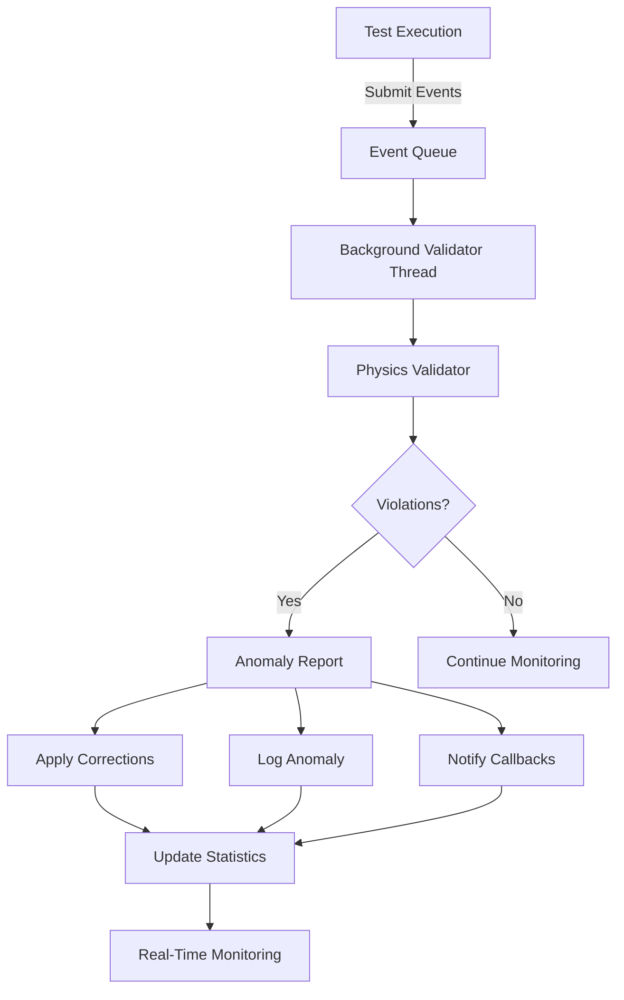

# Background Physics Validation System

## Overview

The Background Physics Validation System provides **real-time physics anomaly detection** during test execution through a multi-threaded architecture. It runs validation in separate background threads while tests execute, enabling immediate detection and correction of physics violations without interrupting test flow.

## Key Features

### 🔬 **Real-Time Validation**

- **Background Threading**: Validation runs in separate threads, never blocking test execution
- **Event-Driven Architecture**: Tests submit validation events asynchronously
- **Continuous Monitoring**: Validates physics parameters as tests progress
- **Low Latency**: 50-100ms validation intervals for responsive anomaly detection

### 🚨 **Anomaly Detection**

- **Physics Constraint Validation**: Checks against 20+ physical constraints
- **Severity Classification**: WARNING, CRITICAL, FATAL severity levels
- **Consecutive Anomaly Tracking**: Detects patterns of repeated violations
- **Context Capture**: Records physics state and test context for each anomaly

### 🔧 **Automatic Correction**

- **Real-Time Corrections**: Automatically applies physics corrections when possible
- **Constraint Clamping**: Bounds values to physically realistic ranges
- **Correction Logging**: Detailed logs of all applied corrections
- **Callback Notifications**: Real-time notifications of corrections applied

### ⚠️ **Escalation System**

- **Threshold-Based Escalation**: Escalates after configurable consecutive anomalies
- **Impact Assessment**: Evaluates the severity and impact of anomalies
- **Critical Alerts**: Immediate notifications for critical physics violations
- **Test Reliability Monitoring**: Tracks test reliability over time

## Architecture



## Integration Patterns

### 1. **Fully Integrated Pipeline**

The background validator is **fully integrated** into the test pipeline through the `IntegratedTestRunner`:

```python
from examples.integrated_test_runner import IntegratedTestRunner

# Run all test suites with background validation
runner = IntegratedTestRunner()
results = runner.run_integrated_tests(['advanced', 'performance', 'maneuvers'])
```

**Benefits:**

- ✅ **Zero Configuration**: Automatic integration with all test suites
- ✅ **Real-Time Monitoring**: Live anomaly detection during test execution
- ✅ **Comprehensive Logging**: All anomalies logged with detailed context
- ✅ **Automatic Corrections**: Physics violations corrected in real-time

### 2. **Manual Integration**

For custom test scenarios, manually integrate background validation:

```python
from drone_sim.utils import background_validator

# Start background validation
background_validator.start_background_validation()

# Submit test events during execution
background_validator.submit_test_event(
    "My Custom Test",
    "test_step",
    test_results,
    {"custom_metadata": "value"}
)

# Stop validation and get summary
summary = background_validator.stop_background_validation()
```

### 3. **Callback-Based Monitoring**

Register callbacks for real-time anomaly notifications:

```python
def on_anomaly(anomaly_report):
    print(f"🚨 {anomaly_report.severity}: {anomaly_report.description}")

def on_correction(test_name, corrections):
    print(f"🔧 Applied corrections to {test_name}: {corrections}")

background_validator.register_anomaly_callback(on_anomaly)
background_validator.register_correction_callback(on_correction)
```

## Configuration

### Default Configuration

```python
{
    'validation_interval': 0.1,      # Check every 100ms
    'anomaly_threshold': 3,          # Escalate after 3 consecutive anomalies
    'auto_correction': True,         # Apply corrections automatically
    'real_time_logging': True,       # Log anomalies in real-time
    'detailed_reports': True,        # Generate detailed anomaly reports
    'physics_context_capture': True, # Capture physics state context
    'performance_monitoring': True,  # Monitor validation performance
    'max_queue_size': 1000,         # Maximum events in queue
    'validation_timeout': 30.0      # Timeout for validation operations
}
```

### Custom Configuration

```python
custom_config = {
    'validation_interval': 0.05,  # More frequent validation (50ms)
    'anomaly_threshold': 2,       # Lower threshold for testing
    'auto_correction': True,      # Keep automatic corrections
}

background_validator.config.update(custom_config)
```

## Usage Examples

### Basic Usage

```python
#!/usr/bin/env python3
from drone_sim.utils import background_validator

# Start validation
background_validator.start_background_validation()

try:
    # Your test code here
    test_data = run_my_test()

    # Submit for validation
    background_validator.submit_test_event(
        "My Test", "test_step", test_data
    )

finally:
    # Stop and get summary
    summary = background_validator.stop_background_validation()
    print(f"Anomalies detected: {summary['total_anomalies']}")
```

### Advanced Integration

```python
class MyTestRunner:
    def __init__(self):
        # Register callbacks
        background_validator.register_anomaly_callback(self._handle_anomaly)
        background_validator.register_correction_callback(self._handle_correction)

    def run_tests(self):
        background_validator.start_background_validation()

        try:
            for test_name, test_func in self.tests:
                # Submit test start
                background_validator.submit_test_event(
                    test_name, "test_start", {}, {"test_type": "custom"}
                )

                # Run test
                results = test_func()

                # Submit results for validation
                background_validator.submit_test_event(
                    test_name, "test_step", results, {"test_type": "custom"}
                )

                # Submit test completion
                background_validator.submit_test_event(
                    test_name, "test_end", results, {"test_type": "custom"}
                )

        finally:
            summary = background_validator.stop_background_validation()
            return summary

    def _handle_anomaly(self, report):
        if report.severity == "CRITICAL":
            self.critical_anomalies.append(report)

    def _handle_correction(self, test_name, corrections):
        self.corrections_applied += len(corrections)
```

## Validation Events

### Event Types

- **`test_start`**: Beginning of test execution
- **`test_step`**: Intermediate test data for validation
- **`test_end`**: Test completion with final results
- **`test_error`**: Test error or failure
- **`shutdown`**: Validation system shutdown

### Event Structure

```python
ValidationEvent(
    timestamp=1234567890.123,
    test_name="Performance Stress Test",
    test_data={
        "real_time_factor": 2.5,
        "efficiency": 0.85,
        "completion_time": 15.2
    },
    event_type="test_step",
    metadata={
        "test_type": "performance",
        "iteration": 1
    }
)
```

## Anomaly Reports

### Report Structure

```python
AnomalyReport(
    timestamp=1234567890.123,
    test_name="Performance Stress Test",
    anomaly_type="3V_2W",  # 3 violations, 2 warnings
    severity="CRITICAL",
    description="3 violations, 2 warnings",
    detected_values={
        "real_time_factor": 500.0,
        "efficiency": 1.2
    },
    suggested_corrections={
        "real_time_factor": 100.0,
        "efficiency": 0.95
    },
    physics_context={
        "event_type": "test_step",
        "queue_size": 5,
        "recent_violation_trend": {
            "avg_violations": 2.4,
            "trend_direction": "increasing"
        }
    },
    impact_assessment="HIGH: 3 consecutive critical violations detected. Test reliability at risk."
)
```

### Severity Levels

#### **WARNING**

- Minor physics inconsistencies
- Values slightly outside normal ranges
- Monitoring recommended
- No immediate action required

#### **CRITICAL**

- Significant physics violations
- Values outside realistic bounds
- Test reliability may be affected
- Automatic corrections applied when possible

#### **FATAL**

- Simulation integrity compromised
- Impossible physics values detected
- Immediate intervention required
- Test execution may need to be stopped

## Real-Time Monitoring

### Statistics Tracking

```python
stats = background_validator.get_real_time_stats()
print(f"Tests Monitored: {stats['stats']['tests_monitored']}")
print(f"Anomalies Detected: {stats['stats']['anomalies_detected']}")
print(f"Queue Size: {stats['queue_size']}")
print(f"Current Test: {stats['current_test']}")
```

### Performance Metrics

- **Validation Rate**: Tests validated per second
- **Queue Utilization**: Event queue usage percentage
- **Processing Latency**: Time from event submission to validation
- **Correction Rate**: Percentage of anomalies automatically corrected

## Logging and Reports

### Log Structure

```
logs/
├── background_validator_20250623_143022/
│   ├── background_validator_detailed.log     # Chronological validation log
│   ├── llm_analysis_data.json               # Structured data for LLM analysis
│   ├── session_summary.json                 # Complete session data
│   └── README.md                            # Human-readable guide
```

### Log Contents

- **Validation Events**: All submitted events with timestamps
- **Anomaly Details**: Complete anomaly reports with context
- **Correction History**: All applied corrections with before/after values
- **Performance Metrics**: Validation efficiency and processing times
- **Error Handling**: Any validation system errors or warnings

## Integration with Test Suites

### Current Integration Status

| Test Suite                 | Integration Status  | Background Validation   |
| -------------------------- | ------------------- | ----------------------- |
| **Advanced Tests**         | ✅ Fully Integrated | ✅ Real-time monitoring |
| **Performance Benchmarks** | ✅ Fully Integrated | ✅ Real-time monitoring |
| **Maneuver Tests**         | ✅ Fully Integrated | ✅ Real-time monitoring |
| **Environmental Tests**    | ✅ Fully Integrated | ✅ Real-time monitoring |
| **Physics Analysis**       | ✅ Fully Integrated | ✅ Real-time monitoring |

### Test Suite Integration

All test suites automatically integrate with background validation when run through:

1. **`IntegratedTestRunner`**: Complete integration with all suites
2. **Individual Test Scripts**: Manual integration available
3. **`run_all_tests_with_logging.py`**: Legacy runner with optional validation

## Running Background Validation

### Option 1: Integrated Test Runner (Recommended)

```bash
# Run all suites with background validation
python examples/integrated_test_runner.py

# Run specific suites
python examples/integrated_test_runner.py --suites advanced performance

# Quick test subset
python examples/integrated_test_runner.py --quick
```

### Option 2: Individual Test with Manual Integration

```python
from drone_sim.utils import background_validator
from examples.advanced_tests import AdvancedTestSuite

# Start background validation
background_validator.start_background_validation()

try:
    # Run your tests
    suite = AdvancedTestSuite()
    results = suite.run_all_tests()

    # Submit results for validation
    background_validator.submit_test_event(
        "Advanced Tests", "test_end", results
    )

finally:
    summary = background_validator.stop_background_validation()
```

### Option 3: Demonstration

```bash
# Run background validation demonstration
python examples/background_validation_demo.py
```

## Best Practices

### 1. **Event Submission Timing**

- Submit `test_start` events before test execution
- Submit `test_step` events for intermediate validation
- Submit `test_end` events with final results
- Submit `test_error` events for failures

### 2. **Metadata Usage**

- Include test type in metadata for better categorization
- Add iteration numbers for repeated tests
- Include configuration parameters for context

### 3. **Callback Registration**

- Register callbacks before starting validation
- Handle exceptions in callbacks to prevent validation thread crashes
- Use callbacks for real-time monitoring and alerting

### 4. **Configuration Tuning**

- Lower `validation_interval` for more responsive validation
- Adjust `anomaly_threshold` based on test sensitivity
- Enable `auto_correction` for automated physics fixes

### 5. **Performance Considerations**

- Monitor queue size to prevent memory issues
- Use appropriate validation intervals for your test duration
- Consider disabling detailed reports for high-frequency tests

## Troubleshooting

### Common Issues

#### **Background Validation Won't Start**

```python
# Check if already running
if background_validator.is_running:
    print("Validation already running")

# Check configuration
print(background_validator.config)
```

#### **Events Not Being Processed**

```python
# Check queue size
stats = background_validator.get_real_time_stats()
print(f"Queue size: {stats['queue_size']}")

# Check if validation thread is alive
if not background_validator.validation_thread.is_alive():
    print("Validation thread has stopped")
```

#### **High Memory Usage**

```python
# Reduce queue size
background_validator.config['max_queue_size'] = 500

# Increase validation interval
background_validator.config['validation_interval'] = 0.2
```

### Debug Mode

```python
import logging
logging.getLogger("background_validator").setLevel(logging.DEBUG)
```

## Future Enhancements

### Planned Features

- **Machine Learning Integration**: Anomaly pattern recognition
- **Predictive Validation**: Predict potential physics violations
- **Distributed Validation**: Multi-process validation for large test suites
- **Web Dashboard**: Real-time validation monitoring interface
- **Custom Validation Rules**: User-defined physics constraints

### Extension Points

- **Custom Validators**: Add domain-specific validation logic
- **External Integrations**: Connect to monitoring systems
- **Advanced Analytics**: Statistical analysis of validation patterns
- **Performance Optimization**: GPU-accelerated validation for large datasets

---

## Quick Start

1. **Use Integrated Runner** (Easiest):

   ```bash
   python examples/integrated_test_runner.py
   ```

2. **Try the Demo**:

   ```bash
   python examples/background_validation_demo.py
   ```

3. **Manual Integration**:

   ```python
   from drone_sim.utils import background_validator

   background_validator.start_background_validation()
   # Your test code here
   summary = background_validator.stop_background_validation()
   ```

The background validation system provides **comprehensive, real-time physics validation** that runs seamlessly alongside your tests, ensuring physics accuracy while maintaining test performance and providing detailed anomaly analysis for continuous improvement of your simulation models.
